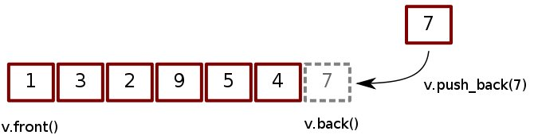

# 🥗Container

這裡簡單介紹幾個較常用到的容器，包括 : vector, set, map, list, queue, stack。

## vector

Vector 可以看成是一個動態陣列 🎄，宣告時可不指定大小，需要時再追加元素😉，而且可以在中間插入\(insert\)、刪除\(erase\)元素。不過要注意在數量很大時，插入和刪除效率會不好的，如果有在最前面增加、刪除元素的需求可以用deque\(雙端佇列\)，效率會比較高喔。



#### 用起來跟陣列很像，常用功能有 :

* push\_back : 把一個值加到尾巴
* pop\_back : 把尾巴的值移除掉
* size : 得到目前長度
* \[\] : 得到某一個位置的值
* insert\( vec.begin\(\) + i, a\) : 在第i+1個元素前面插入a
* erase\( vec.begin\(\) + i , vec.begin\(\) + j \)  //刪除區間 i ~ j-1


```cpp
#include <iostream>
#include <vector>
using namespace std;

int main(){
    vector<int> vec;    // 宣告一個裝 int 的 vector
                        // 現在 vec 是空的
    vec.push_back(10);
    vec.push_back(20);  // 經過三次 push_back
    vec.push_back(30);  // vec 是 [10, 20, 30]

    int length = vec.size();        // length = 3
    for(int i=0 ; i<length ; i++){
        cout << vec[i] << endl;     // 輸出 10, 20, 30
    }

    vec.pop_back();     // 移除 30

    for(int i=0 ; i<vec.size() ; i++){  // vec.size() = 3
        cout << vec[i] << endl;         // 輸出 10, 20
    }
}

```



```cpp
#include<vector>
#include<iostream>
using namespace std;

int main() {
    vector<int> v(3);
    v[0]=2; //v[0]是第1個元素
    v[1]=7;
    v[2]=9;
    v.insert(v.begin(),8);//在最前面插入新元素。
    v.insert(v.begin()+2,1);//在迭代器中第二個元素前插入新元素
    v.insert(v.end(),3);//在向量末尾追加新元素。

    v.insert(v.end(),4,1);//在尾部插入4個1

    int a[] = {1,2,3,4};
    v.insert(v.end(),a[1],a[3]);//在尾部插入a[1]個a[3]，也就是2個4

    vector<int>::iterator it; //使用iterator存取
    for(it=v.begin(); it!=v.end(); it++) {
        cout<<*it<<" ";
    }
    cout<<endl;

    v.erase(v.begin()+2); //刪除第3個元素
    for(auto e : v)
        cout<<e<<" ";
    cout<<endl;

    v.erase(v.begin()+5,v.begin()+9); //刪除區間5~8

    for(auto e : v)
        cout<<e<<" ";
    cout<<endl;
}
/*
output :
    8 2 1 7 9 3 1 1 1 1 4 4
    8 2 7 9 3 1 1 1 1 4 4
    8 2 7 9 3 4 4
*/
```


## set

Set 就是集合內部資料結構為一顆紅黑樹 \(red-black tree\)，裡面的元素都不會重覆，而且都會由小排到大，不過數量多時效率還是會糟的 !


#### 基本功能有: <a id="&#x57FA;&#x672C;&#x529F;&#x80FD;&#x6709;-2"></a>

* insert\(\) : 把一個數字放進集合
* erase\(\) : 把某個數字從集合中移除
* count\(\) : 檢查某個數是否有在集合中


```cpp
#include <iostream>
#include <set>
using namespace std;

int main(){
    set<int> mySet;
    mySet.insert(20);   // mySet = {20}
    mySet.insert(10);   // mySet = {10, 20}
    mySet.insert(30);   // mySet = {10, 20, 30}

    cout << mySet.count(20) << endl;    // 存在 -> 1
    cout << mySet.count(100) << endl;   // 不存在 -> 0

    mySet.erase(20);                    // mySet = {10, 30}
    cout << mySet.count(20) << endl;    // 0
}
```


## map

 它提供搜尋和插入友善的資料結構，並具有一對一 mapping 功能：

* 第一個稱為關鍵字 \(key\)，每個關鍵字只能在 map 中出現一次。
* 第二個稱為該關鍵字的值 \(value\)。

  
Map 的 key-value 對應主要用於資料一對一映射 \(one-to-one\) 的情況，比如一個班級中，每個學生的學號跟他的姓名就存在著一對一映射的關係。

**Map 的特色**

* map 內部資料結構為一顆紅黑樹 \(red-black tree\)，因此：
  * 內部是有排序的資料。
  * 對於搜尋和插入操作友善\( O\(logn\) \)。
* 可以修改 value 值、不能修改 key 值。
* 以模板（泛型）方式實現，可以儲存任意類型的變數，包括使用者自定義的資料型態 。


**1. 宣告**

```cpp
map<string, string> mapStudent;
```

**2. 插入 insert\(\)**

```cpp
// 用 insert 函數插入 pair
mapStudent.insert(pair<string, string>("r000", "student_zero"));

//用 "array" 方式插入
mapStudent["r123"] = "student_first";
mapStudent["r456"] = "student_second";
```

**3. 尋找 find\(\)**

出現時，它返回資料所在位置，如果沒有，返回 iter 與 end\(\) 函數的返回值相同。

```cpp
iter = mapStudent.find("r123");

if(iter != mapStudent.end())
       cout<<"Find, the value is"<<iter->second<<endl;
else
   cout<<"Do not Find"<<endl;
```


**4. 刪除與清空**

清空 map 中的資料可以用 clear\(\) 函數，判定 map 中是否有資料用 empty\(\) 函數，如果回傳 true 則 map 為空，而資料的刪除用 erase\(\) 函數，它有三種 overload 的用法：

```cpp
//迭代器刪除
iter = mapStudent.find("r123");
mapStudent.erase(iter);

//用關鍵字刪除
int n = mapStudent.erase("r123");//如果刪除了會返回1，否則返回0

//用迭代器範圍刪除 : 把整個map清空
mapStudent.erase(mapStudent.begin(), mapStudent.end());
//等同於mapStudent.clear()
```

#### 完整範例 :


```cpp
#include <iostream>
#include <string>
#include <map>

using namespace std;

int main(){

    //declaration container and iterator
    map<string, string> mapStudent;
    map<string, string>::iterator iter;
    map<string, string>::reverse_iterator iter_r;

    //insert element
    mapStudent.insert(pair<string, string>("r000", "student_zero"));

    mapStudent["r123"] = "student_first";
    mapStudent["r456"] = "student_second";

    //traversal
    for(iter = mapStudent.begin(); iter != mapStudent.end(); iter++)
                cout<<iter->first<<" "<<iter->second<<endl;
    for(iter_r = mapStudent.rbegin(); iter_r != mapStudent.rend(); iter_r++)
                cout<<iter_r->first<<" "<<iter_r->second<<endl;

    //find and erase the element
    iter = mapStudent.find("r123");
    mapStudent.erase(iter);

    iter = mapStudent.find("r123");

    if(iter != mapStudent.end())
       cout<<"Find, the value is "<<iter->second<<endl;
    else
       cout<<"Do not Find"<<endl;

    return 0;
}
```


## **list**

 **list** 是[C++標準程式庫](https://zh.wikipedia.org/wiki/C%2B%2B%E6%A8%99%E6%BA%96%E7%A8%8B%E5%BC%8F%E5%BA%AB)中的一個[類](https://zh.wikipedia.org/wiki/%E9%A1%9E)，可以簡單視之為雙向[連結串列](https://zh.wikipedia.org/wiki/%E9%80%A3%E7%B5%90%E4%B8%B2%E5%88%97)，以線性列的方式管理物件集合。list 的特色是在集合的任何位置增加或刪除元素都很快，但是不支持隨機存取。

#### 用法有 :

<table>
  <thead>
    <tr>
      <th style="text-align:left">
        <p></p>
        <p>list.size()</p>
      </th>
      <th style="text-align:left">
        <p></p>
        <p>&#x8A08;&#x7B97;&#x9577;&#x5EA6;</p>
      </th>
    </tr>
  </thead>
  <tbody>
    <tr>
      <td style="text-align:left">
        <p></p>
        <p>list.front()</p>
      </td>
      <td style="text-align:left">
        <p></p>
        <p>&#x53D6;&#x5F97;&#x958B;&#x982D;&#x5143;&#x7D20;</p>
      </td>
    </tr>
    <tr>
      <td style="text-align:left">
        <p></p>
        <p>list.back()</p>
      </td>
      <td style="text-align:left">
        <p></p>
        <p>&#x53D6;&#x5F97;&#x7D50;&#x5C3E;&#x5143;&#x7D20;</p>
      </td>
    </tr>
    <tr>
      <td style="text-align:left">
        <p></p>
        <p>list.begin()</p>
      </td>
      <td style="text-align:left">
        <p></p>
        <p>&#x53D6;&#x5F97;&#x958B;&#x982D;&#x5143;&#x7D20;&#x4E4B;&#x62BD;&#x8C61;&#x6307;&#x6A19;</p>
      </td>
    </tr>
    <tr>
      <td style="text-align:left">
        <p></p>
        <p>list.end()</p>
      </td>
      <td style="text-align:left">
        <p></p>
        <p>&#x53D6;&#x5F97;&#x7D50;&#x5C3E;&#x5143;&#x7D20;&#x4E4B;&#x62BD;&#x8C61;&#x6307;&#x6A19;</p>
      </td>
    </tr>
    <tr>
      <td style="text-align:left">
        <p></p>
        <p>list.push_front()</p>
      </td>
      <td style="text-align:left">
        <p></p>
        <p>&#x589E;&#x52A0;&#x4E00;&#x500B;&#x65B0;&#x7684;&#x5143;&#x7D20;&#x5728;
          list &#x7684;&#x524D;&#x7AEF;</p>
      </td>
    </tr>
    <tr>
      <td style="text-align:left">
        <p></p>
        <p>list.pop_front()</p>
      </td>
      <td style="text-align:left">
        <p></p>
        <p>&#x522A;&#x9664; list &#x7684;&#x7B2C;&#x4E00;&#x500B;&#x5143;&#x7D20;</p>
      </td>
    </tr>
    <tr>
      <td style="text-align:left">
        <p></p>
        <p>list.push_back()</p>
      </td>
      <td style="text-align:left">
        <p></p>
        <p>&#x589E;&#x52A0;&#x4E00;&#x500B;&#x65B0;&#x7684;&#x5143;&#x7D20;&#x5728;
          list &#x7684;&#x5C3E;&#x7AEF;</p>
      </td>
    </tr>
    <tr>
      <td style="text-align:left">
        <p></p>
        <p>list.pop_back()</p>
      </td>
      <td style="text-align:left">
        <p></p>
        <p>&#x522A;&#x9664; list &#x7684;&#x6700;&#x672B;&#x500B;&#x5143;&#x7D20;</p>
      </td>
    </tr>
    <tr>
      <td style="text-align:left">
        <p></p>
        <p>list.insert()</p>
      </td>
      <td style="text-align:left">
        <p></p>
        <p>&#x63D2;&#x5165;&#x4E00;&#x500B;&#x6216;&#x591A;&#x500B;&#x5143;&#x7D20;&#x81F3;
          list&#x5167;&#x7684;&#x4EFB;&#x610F;&#x4F4D;&#x7F6E;</p>
      </td>
    </tr>
    <tr>
      <td style="text-align:left">
        <p></p>
        <p>list.erase()</p>
      </td>
      <td style="text-align:left">
        <p></p>
        <p>&#x522A;&#x9664; list&#x4E2D;&#x4E00;&#x500B;&#x6216;&#x591A;&#x500B;&#x5143;&#x7D20;</p>
      </td>
    </tr>
    <tr>
      <td style="text-align:left">
        <p></p>
        <p>list.reverse()</p>
      </td>
      <td style="text-align:left">
        <p></p>
        <p>&#x8CC7;&#x6599;&#x53CD;&#x7F6E;</p>
      </td>
    </tr>
  </tbody>
</table>
```cpp
#include <iostream> 
#include <list> 
#include <iterator> 
using namespace std; 

//function for printing the elements in a list 
void showlist(list <int> g) 
{ 
	list <int> :: iterator it; 
	for(it = g.begin(); it != g.end(); ++it) 
		cout << '\t' << *it; 
	cout << '\n'; 
} 

int main() 
{ 

	list <int> gqlist1, gqlist2; 


	for (int i = 0; i < 10; ++i) 
	{ 
		gqlist1.push_back(i * 2); 
		gqlist2.push_front(i * 3); 
	} 
	cout << "\nList 1 (gqlist1) is : "; 
	showlist(gqlist1); 

	cout << "\nList 2 (gqlist2) is : "; 
	showlist(gqlist2); 

	cout << "\ngqlist1.front() : " << gqlist1.front(); 
	cout << "\ngqlist1.back() : " << gqlist1.back(); 

	cout << "\ngqlist1.pop_front() : "; 
	gqlist1.pop_front(); 
	showlist(gqlist1); 

	cout << "\ngqlist2.pop_back() : "; 
	gqlist2.pop_back(); 
	showlist(gqlist2); 

	cout << "\ngqlist1.reverse() : "; 
	gqlist1.reverse(); 
	showlist(gqlist1); 

	cout << "\ngqlist2.sort(): "; 
	gqlist2.sort(); 
	showlist(gqlist2); 

	return 0; 
} 
```


## queue

Queue 就像是排隊買東西  
只能往尾巴排，然後從頭出來，但是需注意只能操作頭尾。


#### 基本功能有: <a id="&#x57FA;&#x672C;&#x529F;&#x80FD;&#x6709;"></a>

* push\(\) : 把一個值加到尾巴
* pop\(\) : 把第一個值移除掉
* back\(\) : 得到尾巴的值
* front\(\) : 得到頭的值


```cpp
#include <iostream>
#include <queue>
using namespace std;
int main(){
    queue<int> q;       // 一個空的 queue
    for(int i=0 ; i<5 ; i++){
        q.push(i * 10);
    }                   // [0, 10, 20, 30, 40]

    while(q.size() != 0){
        cout << q.front() << endl;
        q.pop();
    }                   // 依序輸出 0 10 20 30 40
}
```


##  stack

Stack 就是一疊盤子，只能拿走最上面的，或是繼續往上疊。


#### 基本功能有: <a id="&#x57FA;&#x672C;&#x529F;&#x80FD;&#x6709;-1"></a>

* top\(\) : 得到最上面的值
* push\(\) : 再拿一個盤子往上疊
* pop\(\) : 拿掉最上面的盤子


```cpp
#include <iostream>
#include <stack>
using namespace std;
int main(){
    stack<int> s;
    
    s.push(10);     //  | 30 |
    s.push(20);     //  | 20 |   疊三個盤子
    s.push(30);     //  |_10_|   10 在最下面

    for(int i=0 ; i<s.size() ; i++){    // s.size() = 3
        cout << s.top() << endl;
        s.pop();
    }                                   // 輸出 30, 20, 10
}
```


